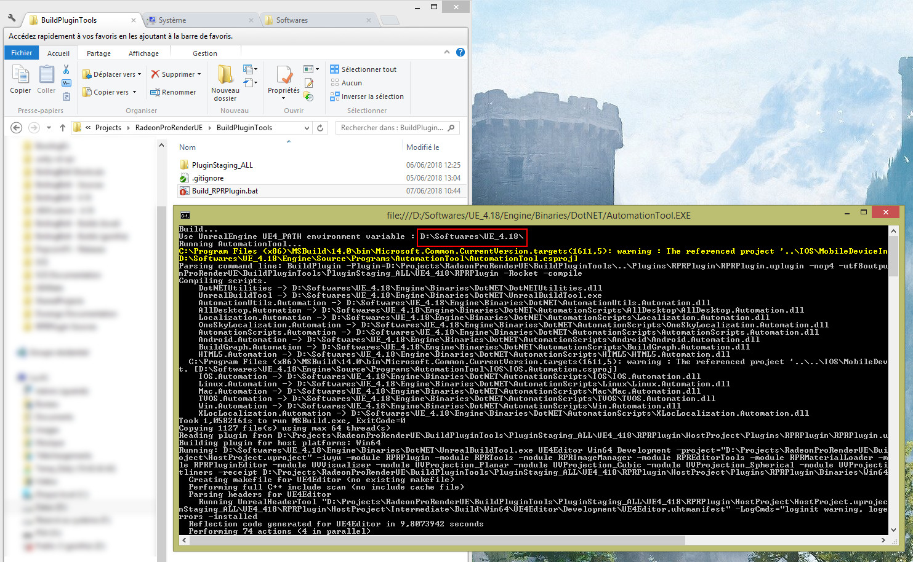

# RadeonProRenderUE

# Setup project

## Generate Visual Studio files

Right-click on RPR.uproject and select "Generate Visual Studio project files". 
It should create a "RPR.sln" file

## Compile

- Open the "RPR.sln" file.
- Check that your build configuration is in "Development Editor" (or "DebugGame Editor")
- Press "Local Windows Debugger" to start the build

At the end of the build, the project should start.

# Build the RPR plugin for marketplace

## For the first time

You will need to set an environment variable that will tell to the build script where is your UE4 installation.

### Windows

- Access to your environment variables from the Advanced System Settings (more information [here](https://www.computerhope.com/issues/ch000549.htm)).
- Press "New" in the "User variables" category
- Set the variable name to **%UE4_Path%** 
- Set the variable value to your UE4 installation root path. 
Examples of valid paths : 
	- D:\Softwares\UE_4.18
	- C:\Program Files (x86)\Epic Games\UE4_4.19

## Start the build

### Windows

- Enter the directory **BuildPluginTools**
- Start **Build_RPRPlugin.bat** (using double-click)
- Wait for everything to be setup. It will take a while since it will compile the whole plugin and copy some binary/image files. 
Make sure that the UE4_Path is correct. Your should see it on the second line of the command line console.
- Once your build is over, go to **PluginStaging_ALL/UE4_[YourUE4Version]**
- Your plugin is right here, ready to be zipped in hosted

